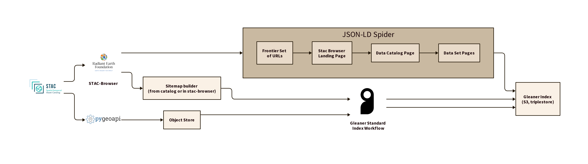

# Survey

The top of an example STAC catalog is at:  https://earth-search.aws.element84.com/v1/

## Questions

1) Spider the JSON-LD  or  focus on sitemap from stac-browser
1) Or, walk the catalog ourselves and build the sitemap.xml which we then drive Gleaner with
   2) which would be the URLs exposed by  [stac-browser](https://github.com/radiantearth/stac-browser/), with likely string regex
1) Im plement a sitemap.xml build in the stac-browser source code
   2) I played with stac-browser briefly, but I am no npm / vue expert, but explore try a bit more
3) Leverage [pyGeoAPI](https://pygeoapi.io/) to read the catalog and expose JSON-LD
   4) Likely a bit more hackable than the stac-browser code
